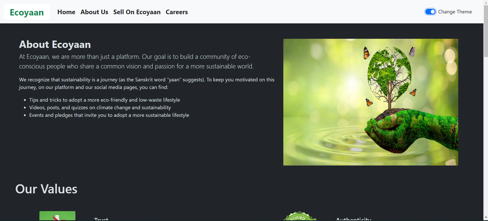

# [Ecoyaan Internship Project 🔗](https://internship-assgn.vercel.app/)

Welcome to the Ecoyaan Internship Project! This project is built using React with Vite, and it features a fully responsive UI with light and dark theme toggling. Below, you'll find instructions on how to set up and run the project, along with its main features.


## [Deployment Link 📌](https://internship-assgn.vercel.app/)


## Preview Image


Click the image above to watch a preview video of the Ecoyaan Internship UI.

Feel free to explore the code, make improvements, and contribute to this project. Happy coding! 🌿🌎

## Getting Started

1. **Clone the Repository:**
   - Clone this repository to your local machine using Git:
     ```
     git clone https://github.com/your-username/ecoyaan-internship.git
     ```

2. **Navigate to the Project Directory:**
   ```
   cd ecoyaan-internship
   ```

3. **Install Dependencies:**
   ```
   npm install
   ```

4. **Run the Development Server:**
   ```
   npm run dev
   ```
   This will start the development server, and you can access the app in your browser at `http://localhost:3000` OR `http://localhost:5173`.

## Main Features

### 1. Theme Toggling (Light/Dark)
- The app supports both light and dark themes.
- Click the "Toggle Theme" button to switch between themes.

### 2. Fully Responsive Design
- The UI adapts to different screen sizes (mobile, tablet, desktop).
- Use media queries and Bootstrap classes to ensure responsiveness.

### 3. Upgraded UI
- The UI has been enhanced with modern design elements.
- Improved typography, spacing, and visual consistency.


### 4. Page Routing with React Router

1. **Leveraging React Router:**
   - The project utilizes React Router to manage navigation between different pages within the application.

   - Routes are defined using `<Route>` components, allowing seamless transitions between views.

2. **Dynamic URL Handling:**
   - Dynamic route parameters are employed to handle specific URLs (e.g., `ecoyaan/about-us, ecoyaan/careers`).